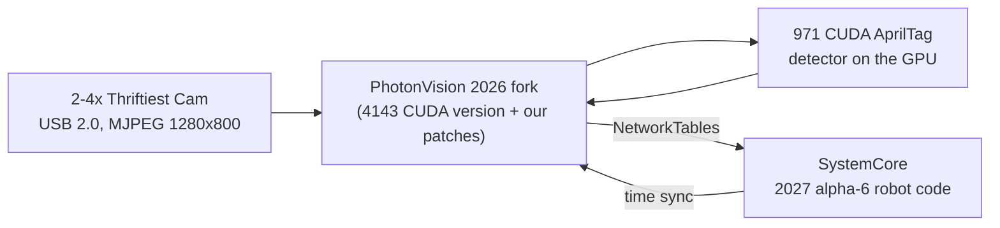

# SpectrumJetson: Jetson Vision Coprocessor Setup

How FRC 3847 / 8515 turned an NVIDIA Jetson Orin Nano Super into a GPU-accelerated AprilTag
vision coprocessor: what we built, why, and how to redo it. The detailed technical reference
(exact versions, commit hashes, every measurement) is in [docs/TECHNICAL.md](docs/TECHNICAL.md).

**Thank you, Austin Schuh.** The CUDA AprilTag detector at the heart of this build is Austin's work, first written for FRC 971 Spartan Robotics. He's the reason any of this works. He now develops it in [RealtimeRoboticsGroup/aos](https://github.com/RealtimeRoboticsGroup/aos) ([`frc/orin`](https://github.com/RealtimeRoboticsGroup/aos/tree/main/frc/orin)). We built from his copy in [frc971/bos](https://github.com/frc971/bos), inside [FRC-Team-4143's CUDA PhotonVision](https://github.com/FRC-Team-4143/photonvision). Full credits are at the [end](#credits-and-licenses).

Built by Spectrum 3847 with Claude Opus 5.5 (Anthropic) in Claude Code, which did the research, code, patches, tests and docs alongside the team.

*Last updated September 24, 2026.*

## Headlines

Measured on the bench:

- **2 AprilTag cameras at 120 fps each, full resolution (1280x800), about 15 ms latency, using about 25% of the CPU.** The cameras are Thrifty Bot [Thriftiest Cams](https://www.thethriftybot.com/products/thriftiest-cam): mono, global shutter, USB 2.0, $50 each. The GPU finds the tags in about 2 ms per frame and is only about 12% busy (peaks under 25%).
- **Set up for 4 AprilTag cameras** on the USB-A ports, with more on a USB-C hub.
- **Game-piece detection at 30 fps alongside the AprilTag cameras,** with no measurable slowdown to them (76 fps if uncapped). It found FUEL surprisingly well even on our mono camera.
- **Rewind:** robot code can record every camera at 30 fps, for 3% of one core, and you can download the recordings from the web UI.
- **Accurate timing:** frames are timestamped at mid-exposure and synced to the robot's clock.
- **Match-ready:**
  - detecting tags about 20 s after power-on
  - an unplugged camera is back in about 1 s
  - survives power cuts
  - restarts itself after errors
- **Works with stock PhotonLib** on a SystemCore (2027 alpha-2).

## Overview

We turned an NVIDIA Jetson Orin Nano Super into a vision coprocessor that finds AprilTags on its GPU, for team 8515's robot at the October 2026 off-season event.

The robot controller is a SystemCore running 2027 alpha-6 robot code. The Jetson runs PhotonVision, the same software many FRC teams use on an Orange Pi. Ours is a special version that sends the AprilTag math to the GPU using a detector written by FRC team 971. The robot code talks to it through PhotonLib over NetworkTables, like any other PhotonVision camera.

Everything we did is scripted in this repo, so another Jetson can be set up the same way. These notes explain what we did and why, including the mistakes, so you can understand the system and not just copy commands.

## How the pieces fit

A camera frame goes over USB into PhotonVision on the Jetson. PhotonVision finds tags with the CUDA detector on the GPU, then sends results to the robot over NetworkTables.



| Piece | What we use |
| --- | --- |
| Computer | Jetson Orin Nano Super devkit (8 GB), booting from a 256 GB NVMe SSD, no SD card |
| Operating system | JetPack 6.2.3 (Jetson Linux 36.5.2, Ubuntu 22.04) with CUDA 12.6 |
| Power mode | MAXN SUPER (the fastest mode, which gives the board its "Super" name) |
| Cameras | 2 (4 planned) Thrifty Bot [Thriftiest Cam](https://www.thethriftybot.com/products/thriftiest-cam) ([docs](https://docs.thethriftybot.com/electrical/thriftiest-cam/latest/overview)): OV9281, mono, global shutter, 1280x800, USB 2.0 |
| Vision software | FRC-Team-4143's PhotonVision fork (2026 version), merged with upstream PhotonVision v2026.3.4, plus our patches |
| Tag detector | Austin Schuh's current CUDA detector (from 971 / RealtimeRoboticsGroup), built from frc971/bos |
| Game pieces | YOLO models on the GPU through TensorRT 10.3 (our backend), FUEL model by Team 2826 |
| Robot side | Stock PhotonLib v2027.0.0-alpha-2 in `2026-FM-SystemCore`, team 8515 |

**Why a 2026 PhotonVision works with 2027 robot code:** the CUDA version of PhotonVision only exists for 2026. We checked the source to confirm the two versions speak the same language:

- the messages have the same format (PhotonLib compares a hash of the message layout, and it matches exactly),
- the NetworkTables protocol is the same,
- time sync is the same.

The one rule: **don't upgrade the robot's PhotonLib past alpha-6.** Newer versions changed the message format, and the robot code would crash when it reads from this Jetson.

## Step 1: Flash JetPack onto the SSD

Flashing writes NVIDIA's operating system onto the Jetson's NVMe SSD and updates the bootloader stored on the board. It's done from an Ubuntu 22.04 laptop over a USB-C cable. The whole flash took about 7 minutes.

**Why JetPack 6.2.3 and not 7:** JetPack 7 now supports this board, but it moves to Ubuntu 24.04 and CUDA 13. The CUDA detector and PhotonVision fork were built for JetPack 6. 6.2.3 was the newest 6.x release, with bug fixes over the 6.2 in our original plan.

1. **Download** the two NVIDIA files, the "BSP" (flashing tools) and the "sample root filesystem" (Ubuntu itself), about 2.6 GB.
2. **Prepare** them on the laptop: `scripts/host/01-prepare-bsp.sh`. It unpacks everything and installs NVIDIA's flashing prerequisites. It also creates the Jetson's user account (`spectrum3847`, hostname `photonvision-3847`), so the first boot doesn't need a monitor and keyboard.
3. **Put the Jetson in recovery mode:**
   - Unplug power.
   - Jumper the **FC REC** and **GND** pins (pins 9 and 10) on the small 12-pin button header under the module. It's *not* the big 40-pin header.
   - Plug power back in, then remove the jumper.
   - Check with `lsusb`: the Jetson should show up as `0955:7523 NVIDIA Corp. APX`.
4. **Flash:** `scripts/host/02-flash-nvme.sh`. The script temporarily stops Ubuntu's network manager from grabbing the Jetson's USB network connection, and temporarily opens the firewall for it. Both are common causes of failed flashes, and both are put back afterward.

**Reading the flash log:** "Waiting for target to boot-up" repeating for about 30 s is normal, and so are warnings like "backup GPT table is corrupt" and missing `mmcblk0boot0`. The flash is only finished at **"Flash is successful"**. "Successfully flashed the external device" comes a couple of minutes earlier, and the bootloader is still being written at that point, so **don't unplug the board then.**

## Step 2: First boot and verification

After flashing, the Jetson boots from the SSD and shows up on the laptop as a USB network device. The Jetson is `192.168.55.1`, and the laptop gets `192.168.55.100`.

1. **Set up SSH keys** so scripts can log in without a password: `ssh-copy-id -i ~/.ssh/jetson_ed25519.pub spectrum3847@192.168.55.1`.
2. **Verify and enable MAXN SUPER:** `scripts/jetson/01-verify.sh` checks three things. The root filesystem must be on the NVMe (`/dev/nvme0n1p1`), the software version must be R36.5.2, and the MAXN SUPER power mode must exist. It then switches to that mode (`nvpmodel -m 2`). Afterward, all 6 CPU cores run at 1728 MHz, and the setting survives reboots.
3. **Get it online.** Over USB it has no internet, and its clock is wrong until it syncs, which makes package downloads fail. Wi-Fi is easiest: `sudo nmcli --ask dev wifi connect <SSID>`.
4. **Install CUDA** with `scripts/jetson/02-jetpack.sh`, which runs `apt install nvidia-jetpack`. Flashing only installs the base OS, so CUDA 12.6, cuDNN and TensorRT come from this step.

**Tip:** never put a password in a script or a chat. On our Jetson the team account has passwordless sudo (`/etc/sudoers.d/90-spectrum3847-nopasswd`, added by the team so setup scripts can run over SSH); on a fresh Jetson, run `sudo` steps in a terminal where you type the password yourself.

## Step 3: Build and install the vision software

The vision stack has four parts. Two are built on the Jetson, one on the laptop, and one is installed from PhotonVision's installer.

| # | Part | Built where | Script | Notes |
| --- | --- | --- | --- | --- |
| 1 | PhotonVision service | Jetson (installer) | `jetson/03-photonvision.sh` | Installs the systemd service that starts PhotonVision at boot. We then replace its jar with the fork. |
| 2 | allwpilib `v2026.2.1` | Jetson | `jetson/04-build-allwpilib.sh` | Libraries the CUDA detector links against. Must be the **v2026.2.1 tag**: its `main` branch has moved on and won't compile with the detector. Took 17 minutes. |
| 3 | CUDA detector `lib971apriltag.so` | Jetson | `jetson/07-build-bos-detector.sh`, then `08-select-detector.sh bos --mwbd 20 --jpeg nvjpg` | Austin Schuh's current code (see below) plus our JNI wrapper in `detector/`. `--jpeg nvjpg` decodes the camera JPEGs on the Jetson's JPEG hardware (`libspectrumnvjpg.so`, see Performance); leave it out to decode on the CPU. |
| 4 | PhotonVision fork jar | Laptop | `host/03-build-photonvision-fork.sh`, then `jetson/06-install-fork-jar.sh` | The 4143 fork, upstream v2026.3.4 (patch 00) and our patches 01–19. It builds on the laptop in about 30 s instead of taxing the Jetson. The Jetson runs it on Java 17. |
| 5 | Camera driver with a bandwidth cap | Jetson | `jetson/11-uvcvideo-payload-cap.sh --install` | Needed for 3–4 cameras on the USB-A ports (see Performance). |
| 6 | TensorRT backend `libspectrumtrt.so` | Jetson | built by `07-build-bos-detector.sh`; install to `/usr/lib` | Game-piece detection. Models go in with `jetson/12-install-yolo-model.sh`. |

**Where the detector code comes from.** FRC 971 (Spartan Robotics) wrote the CUDA AprilTag detector. Austin Schuh, its author, now maintains it in the [**RealtimeRoboticsGroup/aos**](https://github.com/RealtimeRoboticsGroup/aos) repo and works with team 1868. We started with FRC-Team-4143's copy (`GpuDetectorJNI`), which dates from about August 2024. We switched to **frc971/bos**, which has Austin's current code with a CMake build that works on our exact CUDA version. In a side-by-side test, the new detector found tags exactly as well as the old one, and **30–40% faster** (1.7 ms per frame instead of 2.4–3.0 ms).

**Why build on the laptop sometimes?** The fork's jar is Java plus a web UI, with no native code, so it builds the same anywhere. The detector and allwpilib are native ARM and CUDA code, so they have to be built on the Jetson itself (or cross-compiled, which is more work).

**Safe deploys.** `06-install-fork-jar.sh` refuses to install a jar that isn't a valid zip, and it keeps the previous working jar as `photonvision.jar.prev`. We added that after a truncated jar took PhotonVision down (see the bugs section).

**Robot readiness.** `jetson/09-robot-tuning.sh` prepares the Jetson for the robot: no automatic updates, headless boot, snapd off (it was adding 45 s to every boot), clocks locked at max on boot, USB autosuspend off for cameras, power-cut safety (data on the SSD within 3 s, the system log kept across power cuts), the fan at full speed, a 30 s hardware watchdog, reboot on kernel panic, PhotonVision restarted on any exit, and OpenCV's worker threads sleeping instead of spinning. After it, the Jetson boots in 16.5 s instead of 57 s, and both cameras are detecting about 20 s after power-on. `jetson/health-check.sh` prints a PASS / WARN / FAIL readiness report you can run over SSH before a match.

## Bugs we found and fixed

None of this code was written for our exact setup, so we found and fixed several real bugs. Each fix is a small patch file in `patches/`, applied automatically by the build scripts. They're good examples of how real systems fail.

| Bug | What went wrong | Fix |
| --- | --- | --- |
| Memory leak | The detector leaked two small matrices every time it decoded a tag. Over a long event it could run the Jetson out of memory. | Applied Austin's upstream fix (`3e570d5a`). |
| Detector slots | The C++ code had 10 detector slots and never reused them. The 11th pipeline change got handle `-1` and then read past the start of an array, which is undefined behavior. | Reuse slots, check every handle, free detectors properly (`gpudetector-03`). A stress test creates and destroys 300 detectors. |
| Stale CUDA error | CUDA's error flag stays set until someone reads it. Newer CUDA libraries (CUB) fail on *any* leftover error, so one unchecked call broke a later, unrelated call on every frame. | Clear leftover errors before each frame, and check the calls that weren't checked. |
| One GPU error crashed everything | Austin's code aborts the whole program on any CUDA error, which takes PhotonVision down with it. | A CUDA error now skips one frame. PhotonVision restarts only if the whole GPU context is broken (`cudaDeviceSynchronize` fails for 1 s); a failure on one camera never takes the others down (`bos-01` + `detector/`). |
| Blank frames failed every time | With nothing to detect (covered lens, dark pit, plain wall), the detector launched a GPU kernel with 0 blocks, an invalid launch that broke the next step on every frame. Combined with the old watchdog, that restarted PhotonVision in a loop. | Return "no detections" early when there are no candidate blobs (`bos-02`). Reproduced and verified with `tests/detector-frame-sizes`: blank frames failed at 5 resolutions before, pass at all of them now. |
| 62-second restart | Aborting triggered Ubuntu's crash reporter, which spent 28 s writing a 156 MB crash file before the restart could begin. | Exit cleanly instead, and turn off JVM core dumps. Worst-case vision outage went from about 62 s to about 8 s. |
| Blank AprilCudaTag tab | The fork's settings tab was written for an older version of the web framework (Vue 2) and couldn't render in Vue 3. | Ported it to Vue 3, showing only settings that actually do something (`photonvision-01`). |
| Missing Device Control card | PhotonVision used a brand-new browser feature (`Intl.DurationFormat`) to format the uptime. Firefox 130 doesn't have it, so the whole card, including the Restart button, disappeared. | Check for the feature and fall back (`photonvision-03`). Also: keep your browser updated. |
| Truncated jar | A deploy copied a 228 KB piece of a 76 MB jar. PhotonVision couldn't start, and systemd gave up after 5 tries. | The install script now refuses invalid jars and keeps the previous working one. |
| Colour decode hiding in cscore | Asking cscore for grayscale frames still decoded each JPEG to full colour first, then converted it: 8.9 ms a frame, most of a CPU core per camera. | We decode the camera's JPEG straight to gray in our detector library (`photonvision-09`): 2.6 ms. Both cameras went to 122 fps and CPU fell from 3.3 to 1.3 cores. |
| Frozen frames from the JPEG hardware | The Jetson has hardware for decoding JPEGs. The obvious way of calling NVIDIA's library, the way another FRC codebase does it, returned the *first* frame over and over, and reported success every time. A speed test looked great. | We found it by checking every decoded frame against the CPU decoder, pixel for pixel. We call the library differently now (`detector/NvJpgDecoder.cc`), and while running, one frame per camera every 2 s is re-decoded on the CPU and compared. Any difference switches the hardware off (`tests/jpeg-hw/run.sh` repeats the full check). |
| Lens model cut short | Calibration produces 8 lens-distortion numbers, but the fork only passed the first 5 to the CUDA detector. The detector uses them to straighten tag edges when it refines corners, so corners near the image edges came out slightly wrong. | A new `setparams8` call passes all 8 (`photonvision-04` + `detector/`). The log now shows "(8 dist coeffs)" for each camera. |

**Lesson:** check results by *measuring*, not by assuming. The truncated-jar bug happened partly because we trusted a log line from the *old* process. Now every check looks at the running process's own ID.

## Performance: what actually limits the frame rate

We went from 33 fps to the cameras' full **122 fps**, on two cameras at once. The GPU was never the bottleneck: the detector takes under 2 ms per frame, fast enough for 500+ fps. The real limits were the camera exposure, how PhotonVision reads frames, and how it decodes them.

| Change | FPS (1 camera) | Latency | Why it mattered |
| --- | --- | --- | --- |
| Starting point (exposure 295) | 33 | 44 ms | Exposure was 29.5 ms per frame, which caps the frame rate at 34 fps |
| Exposure 83 (8.3 ms) | 61 | 20 ms | The camera can now deliver 120 fps. PhotonVision became the limit |
| Ask cscore for grayscale frames | 62 | 18 ms | Same fps, but Java CPU dropped from 155% to 111% of a core. (Only half the fix: see below.) |
| Low Latency Mode **off** | ~100 | 18 ms | PhotonVision stopped waiting for each frame and missing every other one |
| Two cameras, all of the above | 92 and 104 | ~23 ms | Used 3.3 of 6 CPU cores |
| **Decode the JPEG straight to gray ourselves** (`photonvision-09`) | **122 each** | **13 ms** | cscore was secretly decoding every frame to full colour, then converting (8.9 ms a frame). Our decoder does gray only (2.6 ms). |
| OpenCV's worker threads sleep instead of spin (tuning step 9) | 122 each | 13 ms | 2 cameras now use **1.3 of 6 cores**, down from 3.3 |
| **Decode JPEGs on the Jetson's JPEG hardware** (`--jpeg nvjpg`) | 122 each | not measured | On the same bench scene, back to back: PhotonVision went from 0.85 to **0.52 cores**. The hardware takes ~2.6 ms a frame whatever the scene; the CPU decoder is faster on plain scenes and slower on busy ones. |

**Exposure units are a trap.** USB cameras count exposure in the UVC standard's **100 µs units**, so 295 means 29.5 ms, not 0.3 ms, and stock PhotonVision doesn't say so. We only found this by reading the camera's control directly with `v4l2-ctl`. Our build now shows milliseconds on the slider, e.g. "Exposure (5.0 ms)" (`photonvision-10`).

**Shorter exposure, lower cutoff.** Shorter exposure means less motion blur, but a darker image and a lower **decision margin** (how confidently a tag decoded): about 44 at 3 ms, about 118 at 8.3 ms. PhotonVision drops tags below its cutoff, 35 by default. We run **exposure 50 (5 ms) with the cutoff at 15**. The detector still finds real tags, and tag36h11 at Hamming distance 0 almost never gives false positives.

**Lights flicker.** Mains lighting flickers 120 times per second (every 8.3 ms). At exposures that aren't a multiple of 8.3 ms, each frame can catch a different part of the flicker and pulse in brightness. In our shop at 5 ms we measured no flicker (0.6% brightness change frame to frame) with `tests/flicker-check/run.sh`. **Run it again under the event's lights; if frames pulse by several percent, go back to 83 (8.3 ms).**

**Measure before optimizing.** We added a once-per-second stats line to the detector (calls per second, milliseconds per frame, tags per frame, decision margin). It showed right away that the GPU was idle and the camera pipeline was the problem, which saved us from optimizing the wrong thing.

**More cameras.** Each camera at its full 122 fps now costs about 0.6 of a CPU core (it was 1.4 before the decode fix), and less with the JPEG hardware, so 4 cameras should fit. The limit was **USB bandwidth**. With the stock driver each camera reserves ~196 Mbps whatever mode it runs, and a USB 2.0 root port holds two. All four USB-A ports share one root port, so only 2 cameras fit there.

We fixed that with a patched camera driver (`scripts/jetson/11-uvcvideo-payload-cap.sh`). It caps the Thriftiest Cam's reservation at 82 Mbps (UVC alternate setting 7), still about 1.4x the largest frame we've measured at 120 fps. Now **4 cameras fit on the USB-A ports**, and a hub in the USB-C port adds a second root port for more (tested: 121 fps there). Tested with 2 cameras: 122 fps each, every frame complete. The cost: a 50 KB frame takes ~4.9 ms to cross USB instead of ~2 ms, so results reach the robot ~2 ms later. It does **not** make timestamps less accurate: the driver stamps a frame when its *first* USB packet arrives. Java's memory isn't a concern: the heap peaked at 28 MB with zero garbage collections in 20 s.

**Timestamps mark mid-exposure** (`photonvision-13`): the Jetson subtracts half the exposure from every frame's timestamp, so the robot shouldn't. The camera's own delay (readout and JPEG, before its first packet) is still to be measured on the robot with the spin-in-front-of-a-tag test, and set as `SPECTRUM_CAMERA_DELAY_US`. The camera doesn't send UVC hardware timestamps; we checked.

What other teams' vision systems do (Austin's AOS as run by 1868, 4646 and 254, 971's bos and cos, 6328's Northstar, EagleEye, Code Orange's MLTag, 4533's Whacknet), what an ideal system would have, the full profiling story, and future work: [docs/VISION-RESEARCH.md](docs/VISION-RESEARCH.md).

## Cameras and calibration

Both cameras use the same PhotonVision settings. Each one needs its own calibration at the resolution it will run at.

**Camera settings** (Dashboard, per camera):

- Type: **AprilTagCuda**
- Resolution: **1280x800 at 120 FPS, MJPEG**. Don't use YUYV, which only manages 5 fps at this resolution.
- Auto Exposure off, Exposure **50** (5 ms), Brightness 100
- AprilTagCuda tab: decision margin cutoff **15**
- Low Latency Mode **off**
- Processing Mode **3D** and **multi-tag on** (Output tab), once the camera is calibrated. The robot's pose code needs both.
- Stream Resolution: small, to save CPU (it only affects the video you watch in the browser)
- AprilTag field layout: **2026 Rebuilt AndyMark**. The robot code must use the same layout.

**New cameras start with these settings automatically.** A camera PhotonVision has never seen gets AprilTagCuda, 1280x800 MJPEG, exposure 50, decision margin 15, brightness 100, white balance 2800 K, Low Latency off and multi-tag on (`TeamCameraDefaults` in `photonvision-06`). 3D can't work without a calibration, so it starts off and turns itself on (with multi-tag) as soon as a calibration is saved or imported for the resolution the camera uses. It never turns 3D off. Existing cameras keep their saved settings.

**Cameras are named after their USB port.** Every Thriftiest Cam reports the same name and serial number, so PhotonVision tells them apart only by the port they're plugged into, and each name (and its calibration) stays with its port. The robot code uses the same names, e.g. `new PhotonCamera("TopLeft")`.

| Name | Physical port (looking at the ports) | USB hub port |
| --- | --- | --- |
| TopLeft | top row, left | 2.1 |
| TopRight | top row, right | 2.3 |
| BottomLeft | bottom row, left | 2.2 |
| BottomRight | bottom row, right | 2.4 (expected) |

All four USB-A ports share one USB 2.0 root port. Four cameras fit there only with our capped camera driver installed (`scripts/jetson/11-uvcvideo-payload-cap.sh --install`; the health check shows which driver is loaded). With the stock driver, only two fit.

A calibration belongs to one physical camera and lens, so if you move a camera to another port, recalibrate it there.

**Measuring a camera's mount from the tags** (`photonvision-17`):
- **Where:** with the robot level on the floor and 2+ tags in view, the Targets tab's **Camera mount estimate** shows the camera's height, pitch and roll on the robot, averaged over the last 100 samples with a ± spread.
- **Why it works:** while the robot is level, the camera's height, pitch and roll on the field are its mount's, wherever the robot is.
- **Using it:** the numbers use `robotToCamera`'s axes and signs (negative pitch means tilted up), so they go straight into robot code.
- **Yaw and X/Y** also need the robot's pose. Robot code gets everything from `/photonvision/<camera>/mount` on NetworkTables, and at events it can compare the estimate with its configured mount to catch a bumped camera.
- **Accuracy:** it's only as good as the field's tag layout and a flat floor.

**Calibration board settings** (ChArUco, 5x5 markers, 30 mm squares, 22 mm markers):

| Field | Value |
| --- | --- |
| Resolution | 1280x800 |
| Board Type | ChArUco |
| Tag Family | Dict_5X5_1000 |
| Pattern Spacing (in) | 1.181 (30 mm; this version uses inches) |
| Marker Size (in) | 0.866 (22 mm) |
| Board Width (squares) | **12** |
| Board Height (squares) | **9** |
| Old OpenCV Pattern | off |

The board is labeled "9x12", but **PhotonVision needs width 12, height 9**. With 9x12, every calibration failed with "Negative corner in reprojection error calc". We found the right setting with `tests/charuco-board-check/check_board.py`: it tried all four combinations on a live frame, and only 12x9 found corners (78 of 88).

**Calibration tips:**

- After clicking Start, set **Auto Exposure off and Exposure about 150**. Calibration uses its own settings, and its default was nearly black.
- Take 25–50 snapshots. Cover every corner of the image, tilt the board up to about 45°, vary the distance, and hold still for each shot.
- Aim for a mean reprojection error under about 0.5 px (under 1 px is fine for FRC).
- If a calibration fails and gets stuck, restart PhotonVision (Settings → Restart Software) to clear the bad snapshots.

**Bench calibration results** (checked with `tests/calibration-check/check_calibration.py`, which reads the saved calibration and reports error, outliers and coverage):

| Camera | Snapshots | Corners kept | Mean error | fx | cx, cy |
| --- | --- | --- | --- | --- | --- |
| TopLeft (port 2.1) | 43 | 97% | 0.87 px | 737.8 | 650.5, 362.4 |
| TopRight (port 2.3) | 41 | 96% | 0.97 px | 737.0 | 597.9, 371.6 |

We couldn't get the error below 0.5 px handheld, and that's okay. With so few outliers, the data is clean, and the remaining ~0.8–0.9 px is noise from MJPEG compression. The focal length came out at about 737 px in all three of camera 1's calibrations. **Outliers are the better warning sign.** Our second try had 42% outliers because many snapshots had the board mostly outside the frame. For edge coverage, keep most of the board in the image and just touch the edge.

## Rewind: recording what the cameras saw

Our replacement for Limelight Rewind. While robot code sets `/photonvision/rewind/record` to true in NetworkTables, PhotonVision saves every camera's video to the Jetson's SSD at 30 fps. For real matches that means while enabled with the FMS attached; for a specific test, just around the test. Afterwards, `scripts/host/rewind-pull.sh` copies a recording to the laptop and turns it into videos. Each frame is stamped with the robot's clock, so the video lines up with the AdvantageKit log.

- **It saves the camera's own JPEG frames.** Nothing is decoded or re-encoded, so it costs 3% of one CPU core, and detection fps and latency don't change (measured).
- **About 1 GB per match** with 4 cameras. The oldest recordings are deleted past 100 GB.
- **For bench tests** there's a **Record now** switch in Settings → Rewind.
- **To download a recording**, click the download button next to it in Settings → Rewind. You get a zip with one video (`.avi`) per camera; VLC or Ubuntu's Videos app plays it.

Everything else, including the robot-code example and how to line video up with a log, is in [docs/REWIND.md](docs/REWIND.md).

## Game-piece detection (TensorRT)

PhotonVision's Object Detection pipeline runs YOLO models on the Jetson's GPU through TensorRT. That's our backend: `photonvision-14` plus `libspectrumtrt.so`, built from `detector/TensorRtYoloJNI.cu`. Robot code gets normal PhotonLib targets, with class and confidence.

- **Install a model** from an ONNX export (built into a TensorRT engine on the Jetson; takes several minutes, so do it in the pit):
  ```bash
  ~/SpectrumJetson/scripts/jetson/12-install-yolo-model.sh ~/models/fuel.onnx "Fuel" Fuel
  ```
  Then give the camera a pipeline of type **Object Detection** and pick the model.
- **The 2026 FUEL model** we started with is Team 2826 Wave Robotics' YOLO11n, the same one PhotonVision ships for other hardware. The models we have, their licenses and exports: [docs/GAME-PIECE-MODELS.md](docs/GAME-PIECE-MODELS.md).
- **It works on our mono cameras.**
  - The Object Detection pipeline doesn't ask for gray frames, so a mono camera's JPEG is decoded to a colour image whose three channels are identical. The model runs on that.
  - The model was trained on colour photos, where FUEL is yellow, yet it found real FUEL balls on the bench surprisingly well.
  - We judged that by eye on the stream. Detection rate at distance and false positives haven't been measured yet (Rewind recordings are good for that).
  - Inference costs the same on gray or colour, so the speed numbers below hold for a colour camera too.
- **Measured on the bench** (mono camera, 1280x800 in; measured with nothing else using the GPU):

  | | AprilTag camera beside it | AprilTag detect (avg / worst) | GPU | PhotonVision CPU |
  | --- | --- | --- | --- | --- |
  | FUEL capped at 30 fps (default) | 122 fps | 1.62 / 3.75 ms (same as without FUEL) | 11–30% | 107% |
  | FUEL uncapped (76 fps) | 122 fps | 1.96 / 28 ms | 29–44% | 176% |

  - **Object Detection pipelines are capped at 30 fps by default** (`SPECTRUM_OD_FPS_LIMIT`; a robot-set FPS limit takes precedence). At 30 fps they cost the AprilTag cameras nothing measurable.
  - **Don't build TensorRT engines while measuring.** A `trtexec` build uses the GPU hard for ~8 minutes and made our first measurements look like FUEL doubled the AprilTag detect time. It didn't.
- **Which camera:** a colour camera should do even better (FUEL is yellow), and a mono Thriftiest Cam works too. With 4 Thriftiest Cams on USB-A, put the game-piece camera on the USB-C port, or use a USB 3 camera.

## Troubleshooting quick reference

| Symptom | Likely cause | What to do |
| --- | --- | --- |
| `lsusb` shows no NVIDIA device | Not in recovery mode, or a charge-only USB-C cable | Redo the FC REC–GND jumper with power off. Try a USB-C cable you know carries data. |
| Flash hangs at "Waiting for target to boot-up" for minutes | NetworkManager or the firewall is interfering | Use `02-flash-nvme.sh`, which handles both. |
| Camera doesn't show up (`lsusb`, no `/dev/video*`) | Loose cable, or plugged straight into the USB-C port | Reseat or swap the cable. Cameras work on USB-C through a hub (it's a separate USB root port). |
| A 3rd or 4th camera won't start streaming ("No space left on device") | USB 2.0 bandwidth: the stock camera driver lets each camera reserve ~196 Mbps | Install the capped driver: `scripts/jetson/11-uvcvideo-payload-cap.sh --install`. The health check shows which driver is loaded. |
| Low FPS (~34) | Exposure too long (the units are 100 µs; the slider shows ms) | Exposure 50–83 (5–8.3 ms). |
| Tags flicker in and out | Decision margin near the cutoff (dim light, or flickering light) | Run `tests/flicker-check/run.sh`. If frames pulse, use exposure 83; otherwise lower the cutoff a little. Retune on the field. |
| One camera shows no detections, and the log fills with "invalid JPEG image received" | The camera got stuck sending corrupt frames (seen once after rapid restarts) | Restart PhotonVision; if it persists, replug that camera. The health check warns about this. |
| Image nearly black during calibration | Calibration uses its own exposure settings | In the calibration card: Auto Exposure off, Exposure ~150. |
| Calibration fails ("Negative corner", null intrinsics) | Board width/height swapped | Width 12, height 9. Check with `check_board.py`. Restart PhotonVision to clear bad snapshots. |
| Settings page missing Device Control / Restart | Old browser (no `Intl.DurationFormat`) | Update the browser. Fixed in our patch too. |
| A camera's stream won't show | The browser's connection limit (each open stream holds one) | Close extra PhotonVision tabs, then Ctrl+Shift+R. |
| PhotonVision won't start ("corrupt jarfile") | A bad jar was installed | Reinstall a good jar with `06-install-fork-jar.sh`, or copy back `photonvision.jar.prev`. |
| Robot code throws about a PhotonLib version or message mismatch | Robot PhotonLib upgraded past alpha-6 | Keep `photonlib v2027.0.0-alpha-2`. |
| Gradle build fails with a PKIX/SSL error | The shop network's filter blocked `frcmaven.wpi.edu` | Use another network, or get it allowlisted. |

**Checking on it:** run `scripts/jetson/health-check.sh` for a readiness report. `journalctl -u photonvision -f` shows PhotonVision's live log on the Jetson. The `971 stats` lines show frames per second, detection time and decision margin for each camera. The `971 jpeg` lines (every 10 s) show which JPEG decoder is running and how its checks went.

**Robot code sees the same health on NetworkTables** (`photonvision-16`), once a second:
- `/photonvision/jetson/`: GPU load, temperatures, fan speed, power, and the JPEG decoder's state.
- `/photonvision/<camera>/health/`: fps, pipeline time, latency, and failed JPEG decodes.
- The topics and suggested alerts are in [docs/TECHNICAL.md](docs/TECHNICAL.md) and issue #10.
- `tests/jetson-telemetry/run.sh` prints them on the bench.
- The Settings page's Device Metrics also has a **GPU Usage** chart (`photonvision-19`).

## Where everything lives, and what's left

The detailed technical reference, with exact versions, commits and measurements, is [docs/TECHNICAL.md](docs/TECHNICAL.md). This README is the overview. What this setup lacks compared with Limelight 4, and what the robot code has to do about it (MegaTag 1/2, gyro heading), is in [docs/LIMELIGHT-COMPARISON.md](docs/LIMELIGHT-COMPARISON.md). Other teams' vision systems and our performance work are in [docs/VISION-RESEARCH.md](docs/VISION-RESEARCH.md). What we took from upstream PhotonVision, and what to test, is in [docs/UPSTREAM-PORT.md](docs/UPSTREAM-PORT.md).

| Folder | What's in it |
| --- | --- |
| `scripts/host/` | Run on the laptop: prepare and flash the Jetson (01, 02), build the PhotonVision fork jar (03), back up and restore the SSD (04, 05), copy and export Rewind recordings (`rewind-pull.sh`, `rewind-export.py`) |
| `scripts/jetson/` | Run on the Jetson, in order: verify (01), CUDA (02), PhotonVision service (03), allwpilib (04), 4143 detector (05), install jar (06), current detector (07), pick detector (08), robot tuning (09), camera driver bandwidth cap (11), install a YOLO model (12), plus `health-check.sh` |
| `patches/` | Our fixes to other people's code, applied by the build scripts |
| `detector/` | Our JNI wrapper and CMake build for Austin's current CUDA detector (and the MJPEG decoders, CPU and hardware, and the TensorRT object detector) |
| `kernel/` | Our patch to Linux's USB camera driver (bandwidth cap), built by `11-uvcvideo-payload-cap.sh` |
| `tests/` | Detector stress test, live A/B and fault-injection test, ChArUco board checker, calibration checker, JVM memory check, Rewind on/off test, power-cut test, camera unplug test, robot clock test, flicker check, CPU profiler, performance snapshot, telemetry and mount-estimate check |
| `docs/` | The technical reference, Rewind, the Limelight 4 comparison, vision research, the upstream PhotonVision port, the game-piece models, and the original handoff document that started the project |

**Still to do before the October event:**

- [x] Calibrate both cameras at 1280x800 (done on the bench; redo on the robot)
- [x] Deploy the jar with the Device Control and 8-coefficient fixes
- [x] Robot tuning: no auto-updates, headless boot, clocks locked, USB autosuspend off, power-cut safety (data on the SSD within 3 s, system log kept across power cuts)
- [x] Fan at full speed from boot (43 °C on the bench), 30 s hardware watchdog, reboot on kernel panic, PhotonVision always restarted
- [x] Camera unplug test: the camera detects again ~1 s after it's plugged back in; the other camera is unaffected (`tests/camera-replug/run.sh`)
- [x] Power-cut test: pulled the plug mid-recording. No filesystem errors, the log survived, PhotonVision came back healthy, 1.4 s of video lost (`tests/power-cut/run.sh`)
- [x] Reboot test: tuning survives a reboot; boot 57 s → 16.5 s, first detection ~20 s after power-on
- [x] Name the cameras after their ports (TopLeft, TopRight; BottomLeft/BottomRight when added)
- [x] Wi-Fi / Bluetooth switches in PhotonVision (Bluetooth off; Wi-Fi off before events)
- [x] Static IP 10.85.15.15 on Ethernet (set in PhotonVision: Settings > Networking)
- [x] Rewind: record every camera to the SSD when robot code asks (bench-tested, no fps cost)
- [x] Jetson sets its date from the robot's clock when it has no internet (`photonvision-08`; robot code publishes `/photonvision/clock/unixMs`, issue #10)
- [ ] Test on the robot network with the SystemCore (NetworkTables, time sync, PhotonLib reading results, Rewind's robot-clock timestamps, the Jetson's date from the robot)
- [ ] Turn off Wi-Fi for competition (Bluetooth is already off)
- [ ] Write the vision subsystem in `2026-FM-SystemCore` using the AndyMark field layout, with photonlib kept at alpha-2
- [ ] Check temperatures with the Jetson mounted on the robot (44 °C on the bench with the fan at full speed)
- [x] Decode speedup: both cameras at 122 fps, 13 ms latency, 1.3 of 6 CPU cores
- [x] Upstream PhotonVision v2026.3.4 fixes, `setEnabled()` support, OpenCV leak fixes (`docs/UPSTREAM-PORT.md`)
- [x] Frame timestamps moved to mid-exposure (`photonvision-13`); the camera's own delay is still to be measured with the robot spin test
- [x] Game-piece detection: TensorRT backend, FUEL model working (76 fps uncapped)
- [x] Game-piece pipelines capped at 30 fps by default (no measurable effect on AprilTag cameras)
- [ ] Game-piece colour camera on the robot
- [x] USB bandwidth: capped camera driver so 4 cameras fit on USB-A (alt 7, tested with 2: 122 fps, no bad frames)
- [ ] Test 3–4 cameras on the USB-A ports when they arrive, then re-measure with `tests/perf-snapshot.sh`
- [ ] Retune exposure and decision margin on the event field, and run `tests/flicker-check/run.sh` under its lights
- [ ] Benchmark AprilTags and game pieces in one pipeline on the same camera (plan in [docs/VISION-RESEARCH.md](docs/VISION-RESEARCH.md#future-work))
- [ ] Cheap wins from other teams' systems: Rewind starting itself on enable and named by match, auto-resetting a stuck camera (same doc). Robot-side items, like trusting tags less near the image edge, are in [issue #10](https://github.com/Spectrum3847/2026-FM-SystemCore/issues/10)
- [x] Full backup image of the SSD with PhotonVision's settings (`scripts/host/04-backup-ssd.sh`: 8.7 GB, 7 min). Keep it on the team drive, never GitHub (it holds the Wi-Fi password and SSH keys)
- [x] GitHub release [v2026.09.24](https://github.com/Spectrum3847/SpectrumJetson/releases/tag/v2026.09.24): the PhotonVision jar, TensorRT backend, camera driver and settings
- [ ] Clone a spare SSD from the backup (`scripts/host/05-restore-ssd.sh`)

**Next season:** faster CSI (ribbon-cable) cameras would skip the USB and MJPEG decoding and could reach 120+ fps. That's the setup Austin's AOS system is built around. For October, this USB setup is the right one.

## Credits and licenses

This setup stands on other people's work. We link to or patch their code rather than copy it into this repo, except where noted. Each project keeps its own license.

**Code we build on:**

| Project | What we use | License |
| --- | --- | --- |
| [PhotonVision](https://github.com/PhotonVision/photonvision) | The vision software itself. We merged release v2026.3.4 (patch 00) and ported the server side of `setEnabled` ([#2484](https://github.com/PhotonVision/photonvision/pull/2484), [#2499](https://github.com/PhotonVision/photonvision/pull/2499)) and OpenCV leak fixes ([#2511](https://github.com/PhotonVision/photonvision/pull/2511)). | GPL-3.0 |
| [FRC-Team-4143/photonvision](https://github.com/FRC-Team-4143/photonvision) | The CUDA version of PhotonVision our build starts from (commit `d8c9e8e`). Also their earlier `GpuDetectorJNI` detector build. | GPL-3.0 |
| Austin Schuh and FRC 971's CUDA AprilTag detector | The GPU detector, from [RealtimeRoboticsGroup/aos](https://github.com/RealtimeRoboticsGroup/aos) (Apache-2.0), built from [frc971/bos](https://github.com/frc971/bos) `third_party/971apriltag`. Our `bos-*` patches change it. | Apache-2.0 (aos); bos has no license file |
| [WPILib allwpilib](https://github.com/wpilibsuite/allwpilib) | Built on the Jetson (v2026.2.1) for the detector; cscore and ntcore run inside PhotonVision. | BSD-3-Clause |
| [Linux kernel](https://www.kernel.org/) `uvcvideo` | Our `kernel/uvcvideo-payload-cap.patch` modifies the stock v5.15.199 USB camera driver, fetched from the stable kernel's [GitHub mirror](https://github.com/gregkh/linux). | GPL-2.0 |
| [libjpeg-turbo](https://libjpeg-turbo.org/) | Grayscale MJPEG decode in `detector/GpuDetectorJNI.cc` (the system library). | IJG / BSD-style |
| NVIDIA JetPack, CUDA, TensorRT | The OS, GPU toolkit and inference engine. Hardware JPEG decode uses JetPack's `libnvjpeg` and the Jetson Multimedia API headers. Not redistributed. | NVIDIA licenses |
| [Ultralytics](https://github.com/ultralytics/ultralytics) | Exporting YOLO models to ONNX on the laptop. Not redistributed. | AGPL-3.0 |

**Models:**

- **FUEL YOLO11n by [Team 2826 Wave Robotics](https://www.chiefdelphi.com/t/introducing-wave-robotics-yolov11-model-for-rebuilt/512701).** It's the model PhotonVision ships for 2026; Wave gave PhotonVision permission to include it.
- **FUEL YOLO26n by [Project516](https://huggingface.co/project516/rebuilt-fuel-model)** (AGPL-3.0), downloaded for comparison.

We don't redistribute either; see [docs/GAME-PIECE-MODELS.md](docs/GAME-PIECE-MODELS.md).

**Ideas and research we learned from** (no code copied):

- EagleEye by Scythe-Engineering (grayscale-only decode). It's PolyForm Noncommercial, so we took ideas only.
- Team 3476 Code Orange's ML-assisted AprilTags ("MLTag").
- Team 4533's Whacknet (coprocessor constrained solve).
- 971's bos and cos (TensorRT YOLO, hardware JPEG decode).
- Mechanical Advantage 6328's Northstar.
- Many Chief Delphi threads, linked in [docs/VISION-RESEARCH.md](docs/VISION-RESEARCH.md).

**This repo** is licensed under the [GPL-3.0](LICENSE), following PhotonVision. The kernel patch in `kernel/` is GPL-2.0, like the Linux driver it changes. The scripts, tests, docs and our own code (`detector/`, and the new files in our patches) were written by Spectrum 3847 with Claude Opus 5.5 (Anthropic), working in Claude Code.
