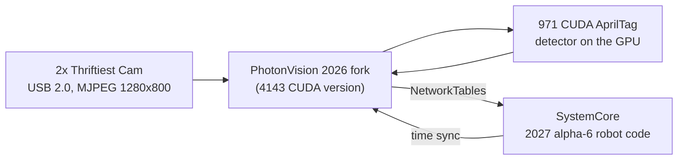

# SpectrumJetson: Jetson Vision Coprocessor Setup

How FRC 3847 / 8515 turned an NVIDIA Jetson Orin Nano Super into a GPU-accelerated AprilTag
vision coprocessor: what we built, why, and how to redo it. The detailed technical reference
(exact versions, commit hashes, every measurement) is in [docs/TECHNICAL.md](docs/TECHNICAL.md).

*Last updated September 24, 2026.*

## Overview

We turned an NVIDIA Jetson Orin Nano Super into a vision coprocessor that finds AprilTags on its GPU. It runs two cameras at about 92 frames per second each, with about 20 ms of latency. It will run on team 8515's robot at the October 2026 off-season event.

The robot controller is a SystemCore running 2027 alpha-6 robot code. The Jetson runs PhotonVision, the same software many FRC teams use on an Orange Pi. Ours is a special version that sends the AprilTag math to the GPU using a detector written by FRC team 971. The robot code talks to it through PhotonLib over NetworkTables, like any other PhotonVision camera.

Everything we did is scripted in this repo, so another Jetson can be set up the same way. These notes explain what we did and why, including the mistakes, so you can understand the system and not just copy commands.

## How the pieces fit

A camera frame goes over USB into PhotonVision on the Jetson. PhotonVision finds tags with the CUDA detector on the GPU, then sends results to the robot over NetworkTables.

| Piece | What we use |
| --- | --- |
| Computer | Jetson Orin Nano Super devkit (8 GB), booting from a 256 GB NVMe SSD, no SD card |
| Operating system | JetPack 6.2.3 (Jetson Linux 36.5.2, Ubuntu 22.04) with CUDA 12.6 |
| Power mode | MAXN SUPER (the fastest mode, which gives the board its "Super" name) |
| Cameras | 2x Thrifty Bot Thriftiest Cam: OV9281, mono, global shutter, 1280x800, USB 2.0 |
| Vision software | FRC-Team-4143's PhotonVision fork (2026 version), plus our patches |
| Tag detector | Austin Schuh's current CUDA detector (from 971 / RealtimeRoboticsGroup), built from frc971/bos |
| Robot side | Stock PhotonLib v2027.0.0-alpha-2 in `2026-FM-SystemCore`, team 8515 |

**Why a 2026 PhotonVision works with 2027 robot code:** the CUDA version of PhotonVision only exists for 2026. We checked the source to confirm the two versions speak the same language:

- the messages have the same format (PhotonLib compares a hash of the message layout, and it matches exactly),
- the NetworkTables protocol is the same,
- time sync is the same.

The one rule: **don't upgrade the robot's PhotonLib past alpha-6.** Newer versions changed the message format, and the robot code would crash when it reads from this Jetson.

## Step 1: Flash JetPack onto the SSD

Flashing writes NVIDIA's operating system onto the Jetson's NVMe SSD and updates the bootloader stored on the board. It's done from an Ubuntu 22.04 laptop over a USB-C cable. The whole flash took about 7 minutes.

**Why JetPack 6.2.3 and not 7:** JetPack 7 now supports this board, but it moves to Ubuntu 24.04 and CUDA 13. The CUDA detector and PhotonVision fork were built for JetPack 6. 6.2.3 was the newest 6.x release, with bug fixes over the 6.2 in our original plan.

1. **Download** the two NVIDIA files, the "BSP" (flashing tools) and the "sample root filesystem" (Ubuntu itself), about 2.6 GB.
2. **Prepare** them on the laptop: `scripts/host/01-prepare-bsp.sh`. It unpacks everything and installs NVIDIA's flashing prerequisites. It also creates the Jetson's user account (`spectrum3847`, hostname `photonvision-3847`), so the first boot doesn't need a monitor and keyboard.
3. **Put the Jetson in recovery mode:**
   - Unplug power.
   - Jumper the **FC REC** and **GND** pins (pins 9 and 10) on the small 12-pin button header under the module. It's *not* the big 40-pin header.
   - Plug power back in, then remove the jumper.
   - Check with `lsusb`: the Jetson should show up as `0955:7523 NVIDIA Corp. APX`.
4. **Flash:** `scripts/host/02-flash-nvme.sh`. The script temporarily stops Ubuntu's network manager from grabbing the Jetson's USB network connection, and temporarily opens the firewall for it. Both are common causes of failed flashes, and both are put back afterward.

**Reading the flash log:** "Waiting for target to boot-up" repeating for about 30 s is normal, and so are warnings like "backup GPT table is corrupt" and missing `mmcblk0boot0`. The flash is only finished at **"Flash is successful"**. "Successfully flashed the external device" comes a couple of minutes earlier, and the bootloader is still being written at that point, so **don't unplug the board then.**

## Step 2: First boot and verification

After flashing, the Jetson boots from the SSD and shows up on the laptop as a USB network device. The Jetson is `192.168.55.1`, and the laptop gets `192.168.55.100`.

1. **Set up SSH keys** so scripts can log in without a password: `ssh-copy-id -i ~/.ssh/jetson_ed25519.pub spectrum3847@192.168.55.1`.
2. **Verify and enable MAXN SUPER:** `scripts/jetson/01-verify.sh` checks three things. The root filesystem must be on the NVMe (`/dev/nvme0n1p1`), the software version must be R36.5.2, and the MAXN SUPER power mode must exist. It then switches to that mode (`nvpmodel -m 2`). Afterward, all 6 CPU cores run at 1728 MHz, and the setting survives reboots.
3. **Get it online.** Over USB it has no internet, and its clock is wrong until it syncs, which makes package downloads fail. Wi-Fi is easiest: `sudo nmcli --ask dev wifi connect <SSID>`.
4. **Install CUDA** with `scripts/jetson/02-jetpack.sh`, which runs `apt install nvidia-jetpack`. Flashing only installs the base OS, so CUDA 12.6, cuDNN and TensorRT come from this step.

**Tip:** anything that needs `sudo` on the Jetson runs in a terminal where you type the password yourself. Nobody should put the password in a script or a chat.

## Step 3: Build and install the vision software

The vision stack has four parts. Two are built on the Jetson, one on the laptop, and one is installed from PhotonVision's installer.

| # | Part | Built where | Script | Notes |
| --- | --- | --- | --- | --- |
| 1 | PhotonVision service | Jetson (installer) | `jetson/03-photonvision.sh` | Installs the systemd service that starts PhotonVision at boot. We then replace its jar with the fork. |
| 2 | allwpilib `v2026.2.1` | Jetson | `jetson/04-build-allwpilib.sh` | Libraries the CUDA detector links against. Must be the **v2026.2.1 tag**: its `main` branch has moved on and won't compile with the detector. Took 17 minutes. |
| 3 | CUDA detector `lib971apriltag.so` | Jetson | `jetson/07-build-bos-detector.sh`, then `08-select-detector.sh bos --mwbd 20` | Austin Schuh's current code (see below) plus our JNI wrapper in `detector/`. |
| 4 | PhotonVision fork jar | Laptop | `host/03-build-photonvision-fork.sh`, then `jetson/06-install-fork-jar.sh` | The 4143 fork plus our patches. It builds on the laptop in about 30 s instead of taxing the Jetson. The Jetson runs it on Java 17. |

**Where the detector code comes from.** FRC 971 (Spartan Robotics) wrote the CUDA AprilTag detector. Austin Schuh, its author, now maintains it in the **RealtimeRoboticsGroup/aos** repo and works with team 1868. We started with FRC-Team-4143's copy (`GpuDetectorJNI`), which dates from about August 2024. We switched to **frc971/bos**, which has Austin's current code with a CMake build that works on our exact CUDA version. In a side-by-side test, the new detector found tags exactly as well as the old one, and **30–40% faster** (1.7 ms per frame instead of 2.4–3.0 ms).

**Why build on the laptop sometimes?** The fork's jar is Java plus a web UI, with no native code, so it builds the same anywhere. The detector and allwpilib are native ARM and CUDA code, so they have to be built on the Jetson itself (or cross-compiled, which is more work).

**Safe deploys.** `06-install-fork-jar.sh` refuses to install a jar that isn't a valid zip, and it keeps the previous working jar as `photonvision.jar.prev`. We added that after a truncated jar took PhotonVision down (see the bugs section).

**Robot readiness.** `jetson/09-robot-tuning.sh` prepares the Jetson for the robot: no automatic updates, headless boot, snapd off (it was adding 45 s to every boot), clocks locked at max on boot, and USB autosuspend off for cameras. After it, the Jetson boots in 16.5 s instead of 57 s, and both cameras are detecting about 20 s after power-on. `jetson/health-check.sh` prints a PASS / WARN / FAIL readiness report you can run over SSH before a match.

## Bugs we found and fixed

None of this code was written for our exact setup, so we found and fixed several real bugs. Each fix is a small patch file in `patches/`, applied automatically by the build scripts. They're good examples of how real systems fail.

| Bug | What went wrong | Fix |
| --- | --- | --- |
| Memory leak | The detector leaked two small matrices every time it decoded a tag. Over a long event it could run the Jetson out of memory. | Applied Austin's upstream fix (`3e570d5a`). |
| Detector slots | The C++ code had 10 detector slots and never reused them. The 11th pipeline change got handle `-1` and then read past the start of an array, which is undefined behavior. | Reuse slots, check every handle, free detectors properly (`gpudetector-03`). A stress test creates and destroys 300 detectors. |
| Stale CUDA error | CUDA's error flag stays set until someone reads it. Newer CUDA libraries (CUB) fail on *any* leftover error, so one unchecked call broke a later, unrelated call on every frame. | Clear leftover errors before each frame, and check the calls that weren't checked. |
| One GPU error crashed everything | Austin's code aborts the whole program on any CUDA error, which takes PhotonVision down with it. | A CUDA error now skips one frame. Only a truly broken GPU (errors for 1 s straight) restarts PhotonVision (`bos-01`). |
| 62-second restart | Aborting triggered Ubuntu's crash reporter, which spent 28 s writing a 156 MB crash file before the restart could begin. | Exit cleanly instead, and turn off JVM core dumps. Worst-case vision outage went from about 62 s to about 8 s. |
| Blank AprilCudaTag tab | The fork's settings tab was written for an older version of the web framework (Vue 2) and couldn't render in Vue 3. | Ported it to Vue 3, showing only settings that actually do something (`photonvision-01`). |
| Missing Device Control card | PhotonVision used a brand-new browser feature (`Intl.DurationFormat`) to format the uptime. Firefox 130 doesn't have it, so the whole card, including the Restart button, disappeared. | Check for the feature and fall back (`photonvision-03`). Also: keep your browser updated. |
| Truncated jar | A deploy copied a 228 KB piece of a 76 MB jar. PhotonVision couldn't start, and systemd gave up after 5 tries. | The install script now refuses invalid jars and keeps the previous working one. |
| Lens model cut short | Calibration produces 8 lens-distortion numbers, but the fork only passed the first 5 to the CUDA detector. The detector uses them to straighten tag edges when it refines corners, so corners near the image edges came out slightly wrong. | A new `setparams8` call passes all 8 (`photonvision-04` + `detector/`). The log now shows "(8 dist coeffs)" for each camera. |

**Lesson:** check results by *measuring*, not by assuming. The truncated-jar bug happened partly because we trusted a log line from the *old* process. Now every check looks at the running process's own ID.

## Performance: what actually limits the frame rate

We went from 33 fps to about 92 fps per camera. Most of that came from settings, not code. The GPU was never the bottleneck: the detector takes under 2 ms per frame, fast enough for 500+ fps. The real limits were the camera exposure and how PhotonVision reads frames.

| Change | FPS (1 camera) | Latency | Why it mattered |
| --- | --- | --- | --- |
| Starting point (exposure 295) | 33 | 44 ms | Exposure was 29.5 ms per frame, which caps the frame rate at 34 fps |
| Exposure 83 (8.3 ms) | 61 | 20 ms | The camera can now deliver 120 fps. PhotonVision became the limit |
| Decode MJPEG straight to grayscale | 62 | 18 ms | Same fps, but Java CPU dropped from 155% to 111% of a core |
| Low Latency Mode **off** | ~100 | 18 ms | PhotonVision stopped waiting for each frame and missing every other one |
| Two cameras, all of the above | ~92 each | ~20 ms | Uses about 2.8 of 6 CPU cores and 18% of the GPU |

**Exposure units are a trap.** PhotonVision labels the exposure slider in microseconds, but this camera counts in **100 µs units**, so 295 means 29.5 ms, not 0.3 ms. We only found this by reading the camera's control directly with `v4l2-ctl`.

**Lights flicker.** Mains lighting flickers 120 times per second (every 8.3 ms). At exposures shorter than that, each frame catches a different point in the flicker, and tags looked unstable. The detector still found the tag in 100% of frames at every exposure we tested. What changed was the **decision margin** (how confidently the tag decoded): about 44 at 3 ms, about 118 at 8.3 ms. PhotonVision drops tags below its cutoff of 35, which is why short exposures blinked. **Use about 83 in the shop, and retune exposure and the decision-margin cutoff on the real field.**

**Measure before optimizing.** We added a once-per-second stats line to the detector (calls per second, milliseconds per frame, tags per frame, decision margin). It showed right away that the GPU was idle and the camera pipeline was the problem, which saved us from optimizing the wrong thing.

**More cameras.** Each camera at ~92 fps costs about 1.4 CPU cores. For 3–4 cameras, turn **Low Latency Mode on**: each camera then runs at ~60 fps for about 1.1 cores, so 4 cameras fit in about 4.5 of 6 cores. Java's memory isn't a concern: the heap peaked at 28 MB with zero garbage collections in 20 s.

## Cameras and calibration

Both cameras use the same PhotonVision settings. Each one needs its own calibration at the resolution it will run at.

**Camera settings** (Dashboard, per camera):

- Type: **AprilTagCuda**
- Resolution: **1280x800 at 120 FPS, MJPEG**. Don't use YUYV, which only manages 5 fps at this resolution.
- Auto Exposure off, Exposure **83**, Brightness 100
- Low Latency Mode **off** (or on, for 3–4 cameras)
- Stream Resolution: small, to save CPU (it only affects the video you watch in the browser)
- AprilTag field layout: **2026 Rebuilt AndyMark**. The robot code must use the same layout.

**Cameras are named after their USB port.** Every Thriftiest Cam reports the same name and serial number, so PhotonVision tells them apart only by the port they're plugged into, and each name (and its calibration) stays with its port. The robot code uses the same names, e.g. `new PhotonCamera("TopLeft")`.

| Name | Physical port (looking at the ports) | USB hub port |
| --- | --- | --- |
| TopLeft | top row, left | 2.1 |
| TopRight | top row, right | 2.3 |
| BottomLeft | bottom row, left | 2.2 |
| BottomRight | bottom row, right | 2.4 (expected; the other three are confirmed) |

A calibration belongs to one physical camera and lens, so if you move a camera to another port, recalibrate it there. All four USB-A ports share one USB 2.0 hub; two MJPEG cameras fit easily, and 3–4 fit at ~60 fps each.

**Calibration board settings** (ChArUco, 5x5 markers, 30 mm squares, 22 mm markers):

| Field | Value |
| --- | --- |
| Resolution | 1280x800 |
| Board Type | ChArUco |
| Tag Family | Dict_5X5_1000 |
| Pattern Spacing (in) | 1.181 (30 mm; this version uses inches) |
| Marker Size (in) | 0.866 (22 mm) |
| Board Width (squares) | **12** |
| Board Height (squares) | **9** |
| Old OpenCV Pattern | off |

The board is labeled "9x12", but **PhotonVision needs width 12, height 9**. With 9x12, every calibration failed with "Negative corner in reprojection error calc". We found the right setting with `tests/charuco-board-check/check_board.py`: it tried all four combinations on a live frame, and only 12x9 found corners (78 of 88).

**Calibration tips:**

- After clicking Start, set **Auto Exposure off and Exposure about 150**. Calibration uses its own settings, and its default was nearly black.
- Take 25–50 snapshots. Cover every corner of the image, tilt the board up to about 45°, vary the distance, and hold still for each shot.
- Aim for a mean reprojection error under about 0.5 px (under 1 px is fine for FRC).
- If a calibration fails and gets stuck, restart PhotonVision (Settings → Restart Software) to clear the bad snapshots.

**Bench calibration results** (checked with `tests/calibration-check/check_calibration.py`, which reads the saved calibration and reports error, outliers and coverage):

| Camera | Snapshots | Corners kept | Mean error | fx | cx, cy |
| --- | --- | --- | --- | --- | --- |
| TopLeft (port 2.1) | 43 | 97% | 0.87 px | 737.8 | 650.5, 362.4 |
| TopRight (port 2.3) | 41 | 96% | 0.97 px | 737.0 | 597.9, 371.6 |

We couldn't get the error below 0.5 px handheld, and that's okay. With so few outliers, the data is clean, and the remaining ~0.8–0.9 px is noise from MJPEG compression. The focal length came out at about 737 px in all three of camera 1's calibrations. **Outliers are the better warning sign.** Our second try had 42% outliers because many snapshots had the board mostly outside the frame. For edge coverage, keep most of the board in the image and just touch the edge.

## Troubleshooting quick reference

| Symptom | Likely cause | What to do |
| --- | --- | --- |
| `lsusb` shows no NVIDIA device | Not in recovery mode, or a charge-only USB-C cable | Redo the FC REC–GND jumper with power off. Try a USB-C cable you know carries data. |
| Flash hangs at "Waiting for target to boot-up" for minutes | NetworkManager or the firewall is interfering | Use `02-flash-nvme.sh`, which handles both. |
| Camera doesn't show up (`lsusb`, no `/dev/video*`) | Loose cable, or plugged into the USB-C port | Use a USB-A port, and reseat or swap the cable. |
| Low FPS (~34) | Exposure too long (the units are 100 µs) | Exposure 83 or lower. Anything up to ~150 still gets full fps. |
| Tags flicker in and out | Decision margin near the cutoff under flickering light | Exposure ~83 in the shop, or lower the cutoff to ~20–25. Retune on the field. |
| Image nearly black during calibration | Calibration uses its own exposure settings | In the calibration card: Auto Exposure off, Exposure ~150. |
| Calibration fails ("Negative corner", null intrinsics) | Board width/height swapped | Width 12, height 9. Check with `check_board.py`. Restart PhotonVision to clear bad snapshots. |
| Settings page missing Device Control / Restart | Old browser (no `Intl.DurationFormat`) | Update the browser. Fixed in our patch too. |
| A camera's stream won't show | The browser's connection limit (each open stream holds one) | Close extra PhotonVision tabs, then Ctrl+Shift+R. |
| PhotonVision won't start ("corrupt jarfile") | A bad jar was installed | Reinstall a good jar with `06-install-fork-jar.sh`, or copy back `photonvision.jar.prev`. |
| Robot code throws about a PhotonLib version or message mismatch | Robot PhotonLib upgraded past alpha-6 | Keep `photonlib v2027.0.0-alpha-2`. |
| Gradle build fails with a PKIX/SSL error | The shop network's filter blocked `frcmaven.wpi.edu` | Use another network, or get it allowlisted. |

**Checking on it:** run `scripts/jetson/health-check.sh` for a readiness report. `journalctl -u photonvision -f` shows PhotonVision's live log on the Jetson. The `971 stats` lines show frames per second, detection time and decision margin for each camera.

## Where everything lives, and what's left

The detailed technical reference, with exact versions, commits and measurements, is [docs/TECHNICAL.md](docs/TECHNICAL.md). This README is the overview.

| Folder | What's in it |
| --- | --- |
| `scripts/host/` | Run on the laptop: prepare and flash the Jetson (01, 02), build the PhotonVision fork jar (03) |
| `scripts/jetson/` | Run on the Jetson, in order: verify (01), CUDA (02), PhotonVision service (03), allwpilib (04), 4143 detector (05), install jar (06), current detector (07), pick detector (08), robot tuning (09), plus `health-check.sh` |
| `patches/` | Our fixes to other people's code, applied by the build scripts |
| `detector/` | Our JNI wrapper and CMake build for Austin's current CUDA detector |
| `tests/` | Detector stress test, live A/B and fault-injection test, ChArUco board checker, calibration checker, JVM memory check |
| `docs/` | The technical reference and the original handoff document that started the project |

**Still to do before the October event:**

- [x] Calibrate both cameras at 1280x800 (done on the bench; redo on the robot)
- [x] Deploy the jar with the Device Control and 8-coefficient fixes
- [x] Robot tuning: no auto-updates, headless boot, clocks locked, USB autosuspend off
- [x] Reboot test: tuning survives a reboot; boot 57 s → 16.5 s, first detection ~20 s after power-on
- [x] Name the cameras after their ports (TopLeft, TopRight; BottomLeft/BottomRight when added)
- [x] Wi-Fi / Bluetooth switches in PhotonVision (Bluetooth off; Wi-Fi off before events)
- [x] Static IP 10.85.15.15 on Ethernet (set in PhotonVision: Settings > Networking)
- [ ] Test on the robot network with the SystemCore (NetworkTables, time sync, PhotonLib reading results)
- [ ] Turn off Wi-Fi and Bluetooth for competition
- [ ] Write the vision subsystem in `2026-FM-SystemCore` using the AndyMark field layout, with photonlib kept at alpha-2
- [ ] Check temperatures with the Jetson mounted on the robot (55 °C on the bench)
- [ ] Retune exposure and decision margin on the event field
- [ ] Take a full backup image of the SSD and export PhotonVision's settings

**Next season:** faster CSI (ribbon-cable) cameras would skip the USB and MJPEG decoding and could reach 120+ fps. That's the setup Austin's AOS system is built around. For October, this USB setup is the right one.
